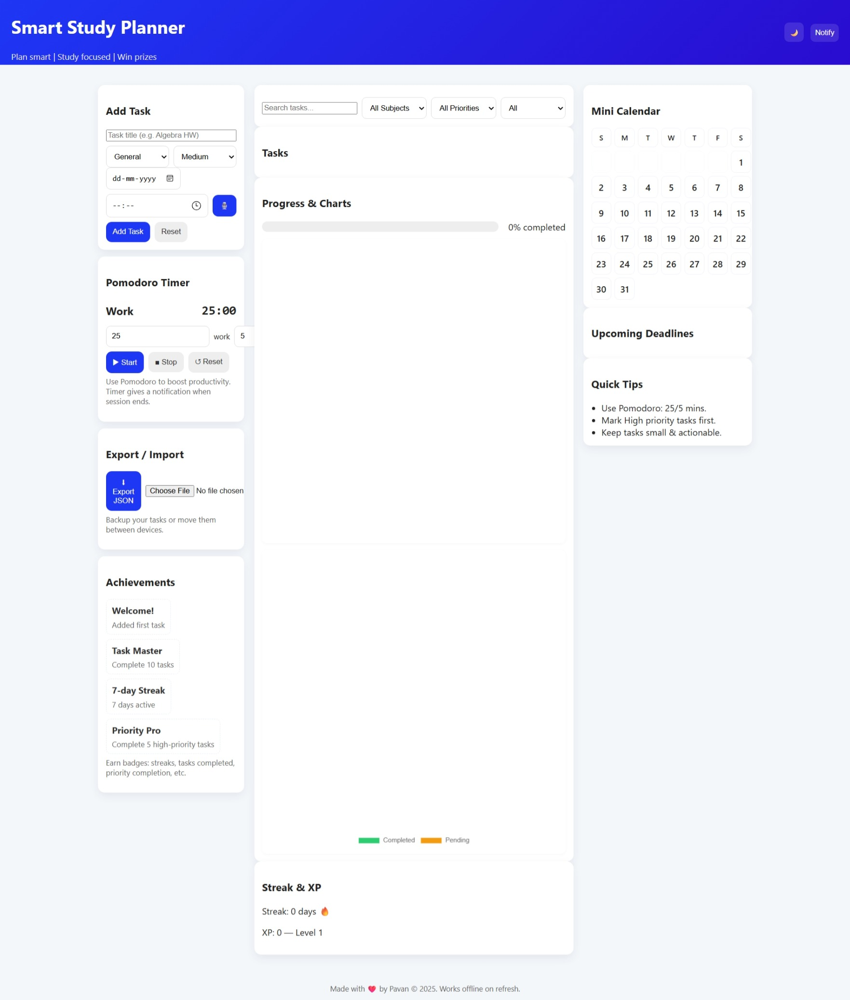
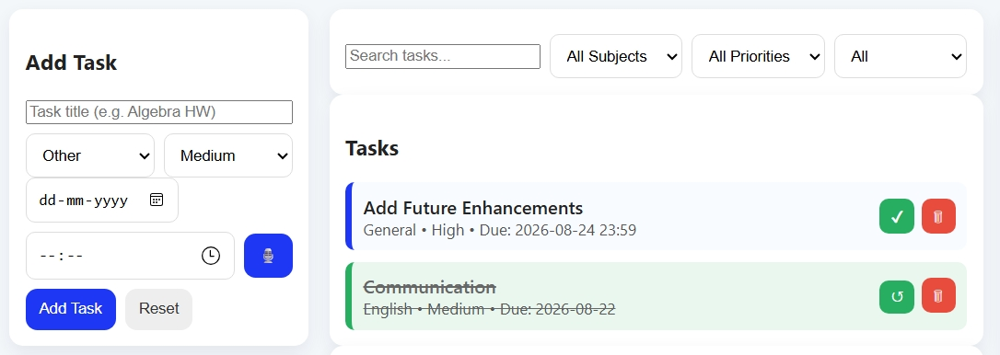
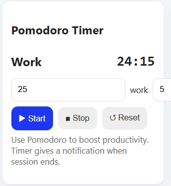
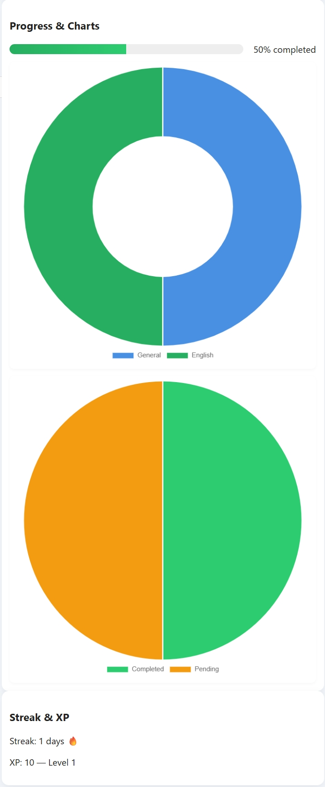

# *Smart Study Planner*
---
> **Plan smarter. Study better. Achieve more.**

**Smart Study Planner** is a responsive, browser-based productivity application designed to help students organize their study schedules, manage academic tasks, stay focused, and track their progress - all without requiring an account or external database.

With features such as **task management, deadlines, reminders, a Pomodoro timer, progress analytics, a mini calendar, badges, and dark mode**, the application provides students with everything they need to build and maintain an effective study routine.

---


## Features

### Task Management

* Add new study tasks with:

  * Task title
  * Deadline
  * Priority
  * Estimated study time
* Edit existing tasks
* Delete tasks
* Mark tasks as completed
* Automatically update progress when tasks are completed

### Smart Calendar

* Mini calendar for quick date navigation
* Highlight days containing scheduled tasks
* Easily identify upcoming deadlines
* Connect calendar dates with study tasks

### Progress Dashboard

* Visual progress bar showing overall completion
* Progress statistics for completed and pending tasks
* Interactive charts powered by **Chart.js**
* Track productivity and study performance over time

### Pomodoro Timer

* Built-in Pomodoro timer for focused study sessions
* Helps divide study time into manageable intervals
* Encourages focused work and regular breaks
* Designed to improve productivity and reduce distractions

### Achievement & Badge System

* Earn badges for reaching productivity milestones
* Provides motivation through visible achievements
* Automatically refreshes as study goals are completed

### Study Timeline

* Visual timeline of upcoming tasks
* Quickly identify approaching deadlines
* Prioritize important study sessions

### Reminders

* Helps students stay aware of upcoming deadlines
* Displays important tasks directly within the planner

### Light & Dark Mode

* Toggle between light and dark themes
* Comfortable interface for both daytime and nighttime study
* Theme preference can be preserved locally

### Responsive Design

* Works across:

  * Desktop
  * Laptop
  * Mobile
  * Tablet
* Uses a responsive grid-based layout for a consistent experience across screen sizes

### Local Data Storage

* Uses browser **LocalStorage** to save tasks and preferences
* No sign-up required
* No external database required
* User data remains stored directly in the browser

## Application Overview

The Smart Study Planner brings multiple productivity tools together in one dashboard:

```text
┌─────────────────────────────────────────────────────────┐
│                  SMART STUDY PLANNER                    │
├─────────────────────────────────────────────────────────┤
│                                                         │
│  📊 Progress       📅 Calendar       🏆 Badges    
│                                                         │
├─────────────────────────────────────────────────────────┤
│                                                         │
│  📝 Study Tasks              ⏱️ Pomodoro Timer         │
│                                                         │
│  • Mathematics              25:00                       │
│  • Physics                  Focus Session               │
│  • Programming                                          │
│                                                         │
├─────────────────────────────────────────────────────────┤
│                                                         │
│              📈 Progress & Analytics                   
│                                                         │
└─────────────────────────────────────────────────────────┘
```

## Tech Stack

| Technology                  | Purpose                                            |
| --------------------------- | -------------------------------------------------- |
| **HTML5**                   | Application structure and semantic markup          |
| **CSS3**                    | Styling, responsive layout, themes, and animations |
| **JavaScript (Vanilla JS)** | Application logic and interactivity                |
| **LocalStorage API**        | Persistent client-side data storage                |
| **Chart.js**                | Progress visualization and analytics               |

### Design Approach

The application uses:

* CSS Custom Properties
* Responsive CSS Grid
* Flexbox
* Mobile-first principles
* Reusable UI components
* Light/Dark theme variables
* Modern card-based dashboard design

## System Development Approach

The project is divided into several functional modules.

### 1. UI/UX Design

A clean and responsive dashboard was designed to make study planning simple and intuitive.

The interface focuses on:

* Easy navigation
* Clear task hierarchy
* Visual progress indicators
* Responsive layouts
* Accessible color contrast
* Minimal distractions

### 2. Task Management Module

This module handles the complete lifecycle of study tasks.

Users can:

1. Create a task
2. Set a deadline
3. Assign a priority
4. Estimate required study time
5. Edit task information
6. Delete tasks
7. Mark tasks as completed

### 3. Visualization Module

The visualization system transforms task data into useful insights.

It includes:

* Overall progress bar
* Completion statistics
* Progress charts
* Upcoming task timeline
* Calendar-based task visualization

### 4. Reminder & Productivity Module

The productivity module combines deadlines with a Pomodoro timer to encourage focused study sessions.

The Pomodoro workflow follows:

```text
Start Focus Session
        ↓
   Study for 25 min
        ↓
    Take a Break
        ↓
   Study Again
        ↓
  Track Productivity
```

### 5. Local Storage Module

All important application data is stored using the browser's LocalStorage API.

Example data flow:

```text
User Input
    ↓
JavaScript
    ↓
Task Object
    ↓
LocalStorage
    ↓
Application State
    ↓
UI Rendering
```

This allows users to close and reopen the application without losing their locally stored tasks.

## Task Management Algorithm

The main task workflow follows these steps:

```text
1. User enters task details
        ↓
2. Validate task information
        ↓
3. Create task object
        ↓
4. Save task to LocalStorage
        ↓
5. Render task in the dashboard
        ↓
6. Display task on timeline/calendar
        ↓
7. User completes task
        ↓
8. Update completion status
        ↓
9. Recalculate progress
        ↓
10. Update charts and statistics
        ↓
11. Check achievement milestones
        ↓
12. Refresh dashboard
```

### Task Data Structure

A task can be represented conceptually as:

```javascript
{
  id: 1,
  title: "Complete Mathematics Assignment",
  deadline: "2026-08-15",
  priority: "High",
  estimatedTime: 60,
  completed: false
}
```

## Progress Calculation

The overall completion percentage can be calculated using:

```text
Progress (%) =
(Completed Tasks / Total Tasks) × 100
```

### Example

If a student has:

* 10 total tasks
* 7 completed tasks

Then:

```text
Progress = (7 / 10) × 100
         = 70%
```

The dashboard automatically updates the progress indicator whenever a task is completed or modified.

## Badge System

The badge system rewards users for reaching study milestones.

Example milestones:

| Achievement     | Example Requirement                           |
| ----------------| --------------------------------------------- |
| Getting Started | Complete your first task                      |
| Productive      | Complete 5 tasks                              |
| Consistent      | Complete tasks across multiple study sessions |
| High Achiever   | Complete 25 tasks                             |
| Study Master    | Reach a major completion milestone            |

The badge system is designed to provide additional motivation and encourage consistent study habits.

## Suggested Project Structure

```text
smart-study-planner/
│
├── index.html
│
├── css/
│   └── style.css
│
├── js/
│   └── script.js
│
├── assets/
│   ├── icons/
│   └── images/
│
├── README.md
└── LICENSE
```

## Getting Started

### Prerequisites

No backend server or database is required.

You only need:

* A modern web browser
* A code editor such as VS Code
* Git (optional)

### 1. Clone the Repository

```bash
git clone https://github.com/your-username/smart-study-planner.git
```

### 2. Navigate to the Project

```bash
cd smart-study-planner
```

### 3. Run the Application

Simply open:

```text
index.html
```

in your browser.

For the best development experience, you can also use the **Live Server** extension in VS Code.

## Data & Privacy

Smart Study Planner is designed with a **local-first approach**.

* No account is required
* No external database is used
* Study tasks are stored in browser LocalStorage
* No backend server is required for core functionality

> **Note:** Clearing the browser's site data may permanently remove locally stored tasks.

## Project Objectives

The primary objectives of Smart Study Planner are to:

* Help students organize academic tasks
* Improve time management
* Encourage consistent study habits
* Reduce missed deadlines
* Provide visual feedback on progress
* Encourage focused study through Pomodoro sessions
* Make productivity tracking simple and accessible

## Future Enhancements

Possible future improvements include:

* Browser push notifications
* Email reminders
* Cloud synchronization
* User authentication
* Progressive Web App (PWA) support
* Export/import study data
* AI-powered study recommendations
* Subject-wise progress tracking
* Custom study goals
* Advanced productivity analytics
* Cross-device synchronization
* Optional focus sounds

## Why Smart Study Planner?

Many productivity applications focus either on task management or time tracking. Smart Study Planner combines several study-focused tools into one lightweight application.

Instead of switching between multiple applications, students can:

```text
Plan
  ↓
Organize
  ↓
Focus
  ↓
Complete
  ↓
Track
  ↓
Improve
```

This creates a simple and continuous study workflow.

## Screenshots

### Dashboard


### Task Management


### Pomodoro Timer


### Progress Analytics


## 🤝 Contributing

Contributions are welcome!

If you'd like to improve Smart Study Planner:

1. Fork the repository
2. Create a new branch

```bash
git checkout -b feature/your-feature
```

3. Make your changes
4. Commit your changes

```bash
git commit -m "Add: your feature"
```

5. Push the branch

```bash
git push origin feature/your-feature
```

6. Open a Pull Request

## Project Backup

A backup of the project data is included in this repository.

[Project Backup JSON](backup/ssp-backup.json)

## License

This project is available under the **MIT License**.

See the [LICENSE](LICENSE) file for more information.

## Author

**Pavan K**

Built with ❤️ using **HTML, CSS, and Vanilla JavaScript**.

## Support the Project

If you find **Smart Study Planner** useful, consider giving the repository a ⭐ on GitHub.

Every star helps the project grow and motivates further development!

> **Smart Study Planner — Turn your study goals into consistent progress.**